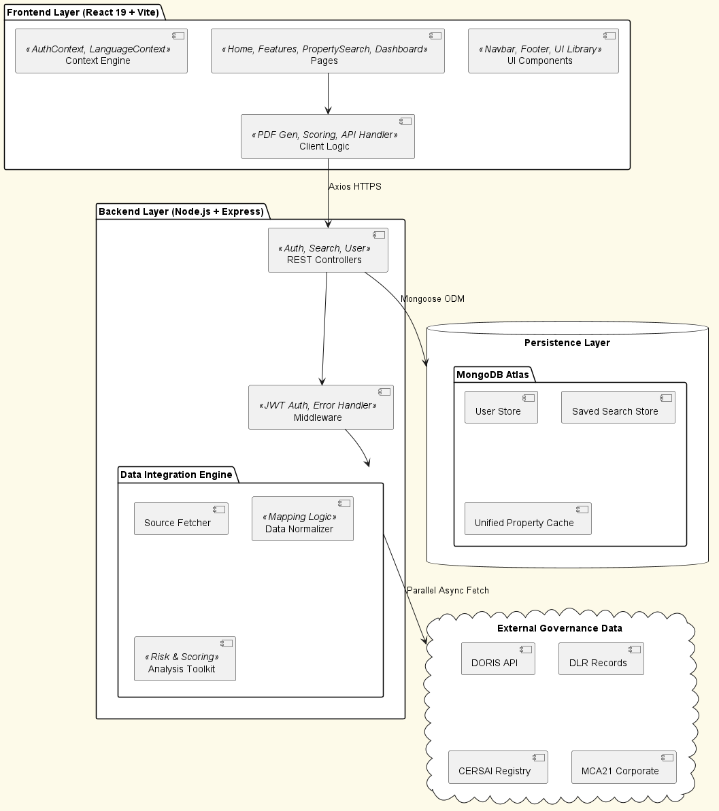

# 🏗️ OmniProp (Udaan)

[](https://www.mongodb.com/mern-stack)
[](https://react.dev/)
[](https://tailwindcss.com/)
[](https://opensource.org/licenses/MIT)

**OmniProp** is a state-of-the-art property search and analysis ecosystem specifically engineered for the Indian real estate market. It serves as a single source of truth by aggregating statutory data from four major government databases into a unified, actionable intelligence platform.

---

## 🌟 Key Features

### 🔍 Unified Search Intelligence
*   **Multi-Source Integration**: Simultaneously query **DORIS**, ** land records (DLR)**, **CERSAI** (mortgage registry), and **MCA21** (corporate ownership).
*   **Flexible Discovery**: Search by owner name, plot number, khasra/khata identifiers, registration details, or company CIN.
*   **Location Awareness**: Integrated interactive maps with deep classification for Urban (SRO/Locality) and Rural (Tehsil/Village) zones.

### 🛡️ Risk & Investment Analytics
*   **Automated Due Diligence**: Instant detection of mutation gaps, pending encumbrances, liens, or legal conflicts.
*   **Proprietary Scoring**: AI-driven **Investment Scoring (0-100)** based on location quality, title clarity, and corporate health.
*   **Verified Data Pipelines**: Standardized mapping that resolves inconsistencies across disparate government schemas.

### 📊 Professional Outputs
*   **Interactive Metrics**: Real-time platform stats tracking 1M+ property records.
*   **Executive PDF Reports**: Generate comprehensive property dossiers with risk summaries and investment breakdowns.
*   **Global Access**: Full internationalization support with **English & Hindi** switching.

---

## 💻 Tech Stack

| Frontend | Backend | Dev Tools |
| :--- | :--- | :--- |
| React 19 + Vite | Node.js + Express | ESLint + PostCSS |
| Framer Motion (Animations) | MongoDB + Mongoose | Nodemon |
| Material UI / Tailwind CSS | JWT / Bcrypt (Auth) | Axios |
| i18next (Localization) | CORS Support | Formik + Yup |

---

## 🚀 Getting Started

### Prerequisites
*   Node.js (v18+)
*   MongoDB Instance (Local or Atlas)

### 1. Repository Setup
```bash
git clone https://github.com/Sarthak-Salunke/OmniProp.git
cd OmniProp
```

### 2. Backend Configuration
1. Navigate to `Backend/`
2. Create `.env` based on `.env.example`:
   ```bash
   MONGODB_URI=your_mongodb_uri
   JWT_SECRET=your_jwt_secret
   PORT=5000
   ```
3. Install and start:
   ```bash
   npm install
   npm run dev
   ```

### 3. Frontend Configuration
1. Navigate to root/ `OmniProp-main/`
2. Create `.env` based on `.env.example`:
   ```bash
   VITE_API_URL=http://localhost:5000/api
   ```
3. Install and start:
   ```bash
   npm install
   npm run dev
   ```

---

## 🏗️ System Architecture

OmniProp utilizes a **Modular Integration Layer** approach:
1.  **Request Layer**: Parallel fetching from 4 source databases using `Promise.all`.
2.  **Standardization Layer**: `dataMapper.js` normalizes field names and date formats.
3.  **Intelligence Layer**: Algorithms calculate Risk and Investment scores.
4.  **Presentation Layer**: Highly responsive, animated UI that respects motion preferences.



---

## 🛣️ Roadmap
- [ ] **AI Predictive Pricing**: Machine learning models for future property valuation.
- [ ] **Historical Timeline**: Visualizing ownership chain transfers over decades.
- [ ] **Distressed Asset Alerts**: Automated notification for properties under liquidation.
- [ ] **Blockchain Ledger**: Immutable title verification for private transactions.

---

## 📄 License
Distributed under the MIT License. See `LICENSE` for more information.

---
**Maintained by [Sarthak Salunke](https://github.com/Sarthak-Salunke)**